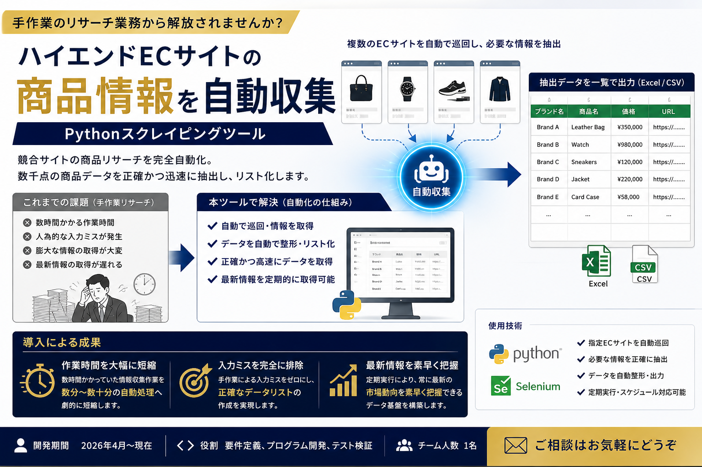

# 🚀 Auto-Pager Data Scraper (無限スクロール＆データ自動収集ツール)




「もっと見る」ボタンで無限に続くWebページのデータを、完全自動で最後まで展開し、CSVとして抽出するツールです。
**手作業によるコピペ業務をゼロにし、営業リスト作成や市場調査を自動化します。**

## 🎯 なぜこれを作ったか（ビジネス価値）
PR TIMESなどのポータルサイトは「もっと見る」ボタンの中にデータが隠されており、手作業での収集には膨大な時間がかかります。
本ツールは、URLとボタンの場所を指定するだけで、誰でも1クリックで最新のビジネスデータを数百〜数千件規模で自動収集できるように設計しました。

## ✨ 特徴 (Features)
- **環境非依存**: ターゲットURLや設定はすべて .env で外部管理。
- **堅牢な設計**: ポップアップ広告の干渉を防ぐJavaScript強制クリックを採用。
- **デバッグ機能**: 万が一抽出が空になった場合、直前のボットの視界（HTML）を自動保存。

## 💡 活用事例（PR TIMESの最新企業リスト抽出）

.env ファイルを以下のように設定するだけで、PR TIMESから最新の企業リストを即座に生成できます。

TARGET_URL=https://prtimes.jp/technology/
BUTTON_SELECTOR=a.js-list-article-more-button
ITEM_SELECTOR=article.list-article
OUTPUT_CSV=prtimes_tech_list.csv
MAX_CLICKS=10
HEADLESS=False

## 🛠️ 使い方 (Getting Started)

以下の3ステップで動作します。

### 1. 必要なライブラリのインストール
ターミナル（黒い画面）で以下の命令を実行し、プログラムを動かすための道具を揃えます。
pip install -r requirements.txt

### 2. 環境変数の設定
.env ファイルに、抽出したいターゲットサイトの情報を記述します。

### 3. 実行
以下のコマンドでスクレイピングを開始します。
python auto_pager_scraper.py

## 📁 ディレクトリ構成
このプロジェクトは以下のファイルで構成されています。

Auto-Pager-Scraper/
├── .env                  # ユーザー設定ファイル
├── auto_pager_scraper.py # メイン実行ファイル
├── requirements.txt      # 依存ライブラリ一覧
└── README.md             # 本説明書

---

## 🌐 English

### What is this?
Auto-Pager Data Scraper is a Python tool that automatically expands paginated web pages with "Load More" buttons and extracts the full dataset as a CSV file.
It eliminates manual copy-paste work and automates tasks like building sales lead lists or conducting market research.

### Why this was built
Many portal sites (e.g. press release aggregators) hide data behind "Load More" buttons, making manual collection extremely time-consuming.
This tool lets anyone collect hundreds to thousands of records in one click, simply by specifying the target URL and button selector.

### Features
- **Environment-agnostic**: All target URLs and settings are managed externally via `.env`.
- **Robust design**: Uses JavaScript-forced clicks to bypass popup ad interference.
- **Debug support**: If extraction returns empty, the bot's last-seen HTML is automatically saved for inspection.

### Installation
```bash
pip install -r requirements.txt
```

### Configuration (.env)
```env
TARGET_URL=https://example.com/list
BUTTON_SELECTOR=a.load-more-button
ITEM_SELECTOR=article.list-item
OUTPUT_CSV=output.csv
MAX_CLICKS=10
HEADLESS=False
```

| Key | Description | Default |
|---|---|---|
| `TARGET_URL` | URL of the target page | Required |
| `BUTTON_SELECTOR` | CSS selector of the "Load More" button | Required |
| `ITEM_SELECTOR` | CSS selector of the data items to extract | Required |
| `OUTPUT_CSV` | Output CSV filename | `output.csv` |
| `MAX_CLICKS` | Maximum number of button clicks | `10` |
| `HEADLESS` | Run browser in headless mode | `False` |

### Usage
```bash
python auto_pager_scraper.py
```

### Output
A UTF-8 BOM encoded CSV file is generated at the path specified by `OUTPUT_CSV`.

### ⚠️ Legal Notice
This tool is intended for personal research and educational use.
Always review the target site's Terms of Service and respect its `robots.txt` before scraping.
The developer assumes no responsibility for any misuse.

### License
MIT License
